I enjoy turning complex business workflows into clean, reliable, and maintainable software. My work focuses on HRIS systems, backend development, SQL performance tuning, clean architecture, and practical tools that help users work faster with better data.

---

# 💫 About Me:

- I maintain, enhance, and optimize HRIS and business-critical systems.
- I work across backend APIs, SQL databases, application logic, and system performance.
- I care about clean code, scalable database design, and maintainable architecture.
- I enjoy refactoring legacy systems into cleaner, faster, and more reliable solutions.

# 👨‍💻 Professional Experience

- Maintained and supported an existing HRIS through bug fixes, code refactoring, and performance tuning.
- Optimized backend logic and SQL queries using CTEs, indexing, and query review, reducing page load times for large datasets by around 40%.
- Improved database performance by optimizing existing views and strengthening scalability for growing data.
- Cleaned and refactored legacy code to improve system stability, readability, and long-term maintainability.
- Implemented Git version control across projects to improve collaboration, traceability, and code quality.
- Delivered system enhancements, new features, and performance improvements based on business requirements and user feedback.
- Refactored and redesigned core timekeeping business logic to improve accuracy, maintainability, and performance.

## 🏢 Organizations

[-1a1a2e?style=for-the-badge&logo=buildkite&logoColor=white)](https://github.com/DBIC-IT-Software)

> Private organization work — contribution details aren't publicly visible per org privacy settings, but activity is reflected in the stats below via private contribution counting.

## 🌐 Socials:

## Tech I Work With

### 🎨 Frontend

### ⚙️ Backend

### 🗄️ Database

### 🌐 Servers & Infra

### 🛠️ Tools

### 💻 Editors / IDE

### 🚀 Deployment & Hosting

# 📊 GitHub Stats:
 
 

### 🐍 Contribution Snake
<picture>
  <source media="(prefers-color-scheme: dark)" srcset="https://raw.githubusercontent.com/5344Luc/5344Luc/output/github-contribution-grid-snake-dark.svg">
  <source media="(prefers-color-scheme: light)" srcset="https://raw.githubusercontent.com/5344Luc/5344Luc/output/github-contribution-grid-snake.svg">
  
</picture>

### ✍️ Dev Quote

## 🏆 GitHub Trophies

### 🔝 Top Contributed Repo

